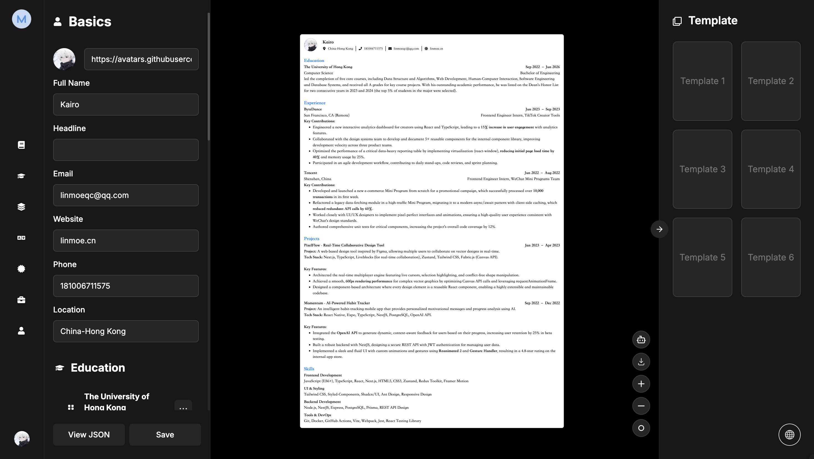

<div align="center">
  <a href="https://magic-resume.cn">
    
  </a>

  <h1>Magic Resume</h1>

  <p><strong>The next-gen AI-powered resume platform that makes hiring simple.</strong></p>

**English** · [简体中文](./README.zh-CN.md) · [Official Site][official-site] · [Feedback][github-issues-link]

  <!-- SHIELD GROUP -->

<<<<<<< HEAD
[![][vercel-shield]][vercel-link]
=======
[![][github-release-shield]][github-release-link]
[![][vercel-shield]][vercel-link]
[![][github-action-test-shield]][github-action-test-link]
>>>>>>> master
[![][github-contributors-shield]][github-contributors-link]
[![][github-forks-shield]][github-forks-link]
[![][github-stars-shield]][github-stars-link]
[![][github-issues-shield]][github-issues-link]
[![][github-license-shield]][github-license-link]

</div>

<details>
<summary><kbd>Table of contents</kbd></summary>

#### TOC

- [👋� Getting Started](#-getting-started)
- [✨ Features](#-features)
  - [Build: Visual Template Customization](#build-visual-template-customization)
  - [Analyze: Lighthouse-style Reports](#analyze-lighthouse-style-reports)
  - [Optimize: AInd intelligent JD Matching](#optimize-intelligent-jd-matching)
  - [Privacy: Local-First Data Security](#privacy-local-first-data-security)
- [🛳 Self Hosting](#-self-hosting)
  - [Deploying with Vercel](#deploying-with-vercel)
- [📦 Ecosystem](#-ecosystem)
- [⌨️ Local Development](#️-local-development)
- [🤝 Contributing](#-contributing)
- [📈 Star History](#-star-history)

####

<br/>

</details>

<br/>



## 👋🏻 Getting Started

**Magic Resume** is a modern, AI-powered resume builder designed to help job seekers craft professional, high-impact resumes with ease. Built with Next.js 15, it combines a sleek user interface with powerful AI capabilities to streamline your job search journey.

## ✨ Features

### Build: Visual Template Customization

Create a professional resume in minutes with our intuitive visual editor.

- **Real-time Preview**: See your changes instantly as you type.
- **Flexible Templates**: Choose from professional, ATS-friendly templates.
- **Rich Customization**: Adjust colors, fonts (22+ styles), spacing, and layouts with ease.

### Analyze: Lighthouse-style Reports

Get professional feedback on your resume's health.

- **Overall Score**: A comprehensive rating of your resume's impact.
- **Detailed Analysis**: Insights into keyword matching, actionability, and readability.
- **Actionable Suggestions**: Specific advice to make your resume stand out.

### Optimize: Intelligent JD Matching

Tailor your resume to specific job descriptions with AI.

- **Smart Alignment**: AI analyzes the Job Description (JD) and suggests content optimizations.
- **Role-based Suggestions**: Get advice tailored to specific industries and roles.

### Privacy: Local-First Data Security

Your data stays with you.

- **Local Storage**: All resume data is stored locally in your browser by default.
- **Optional Cloud Sync**: Securely sync your data across devices if you choose.
- **Multi-format Export**: Export your resume to high-quality PDF or structured JSON.

---

## 🛠 Tech Stack

- **Framework**: [Next.js 15](https://nextjs.org/) (App Router)
- **Language**: [TypeScript](https://www.typescriptlang.org/)
- **AI / LLM**: [LangChain](https://www.langchain.com/), [LangGraph](https://www.langchain.com/langgraph), [Google GenAI](https://ai.google.dev/), [Anthropic](https://www.anthropic.com/)
- **Authentication**: [Clerk](https://clerk.com/)
- **Styling**: [Tailwind CSS 4](https://tailwindcss.com/)
- **UI Components**: [Radix UI](https://www.radix-ui.com/), [Lucide Icons](https://lucide.dev/)
- **Animations**: [Framer Motion](https://www.framer.com/motion/), [GSAP](https://gsap.com/)
- **State Management**: [Zustand](https://zustand-demo.pmnd.rs/)
- **Database / Storage**: [IndexedDB](https://developer.mozilla.org/en-US/docs/Web/API/IndexedDB_API) (Local-first)
- **Rich Text Editor**: [Tiptap](https://tiptap.dev/), [Monaco Editor](https://microsoft.github.io/monaco-editor/)
- **Internationalization**: [i18next](https://www.i18next.com/)
- **Analytics**: [PostHog](https://posthog.com/)

---

## 🛳 Self Hosting

Deploy your own instance of Magic Resume in minutes.

### Deploying with Vercel

Click the button below to deploy to Vercel:

[](https://vercel.com/new/clone?repository-url=https%3A%2F%2Fgithub.com%2FLinMoQC%2FMagic-Resume)

> [!TIP]
>
> Remember to configure your `NEXT_PUBLIC_CLERK_PUBLISHABLE_KEY` and `CLERK_SECRET_KEY` in the Vercel dashboard.

---

## 📦 Ecosystem

- **Magic Resume Core**: The primary resume builder and AI engine.
- **i18n Scanner**: A custom tool to ensure full localization coverage.

---

## ⌨️ Local Development

Clone the repository and start the development server:

```bash
$ git clone https://github.com/LinMoQC/Magic-Resume.git
$ cd Magic-Resume
$ npm install
$ npm run dev
```

For more details, check our [Development Guide](./docs/development.md) (coming soon).

---

## 🤝 Contributing

Contributions are welcome! Please feel free to submit a Pull Request.

<a href="https://github.com/LinMoQC/Magic-Resume/graphs/contributors">
  
</a>

---

## 📈 Star History

[](https://star-history.com/#LinMoQC/Magic-Resume&Date)

---

Copyright © 2026 [Magic Resume Team](https://github.com/LinMoQC). <br />
This project is [MIT](./LICENSE) licensed.

<!-- LINK GROUP -->

[official-site]: https://magic-resume.cn
[github-issues-link]: https://github.com/LinMoQC/Magic-Resume/issues
<<<<<<< HEAD
[vercel-shield]: https://img.shields.io/badge/vercel-online-55b467?labelColor=black&logo=vercel&style=flat-square
[vercel-link]: https://magic-resume.cn
[github-contributors-shield]: https://img.shields.io/github/contributors/LinMoQC/Magic-Resume?color=c4f042&labelColor=black&style=flat-square
[github-contributors-link]: https://github.com/LinMoQC/Magic-Resume/graphs/contributors
[github-forks-shield]: https://img.shields.io/github/forks/LinMoQC/Magic-Resume?color=8ae8ff&labelColor=black&style=flat-square
[github-forks-link]: https://github.com/LinMoQC/Magic-Resume/network/members
[github-stars-shield]: https://img.shields.io/github/stars/LinMoQC/Magic-Resume?color=ffcb47&labelColor=black&style=flat-square
[github-stars-link]: https://github.com/LinMoQC/Magic-Resume/stargazers
[github-issues-shield]: https://img.shields.io/github/issues/LinMoQC/Magic-Resume?color=ff80eb&labelColor=black&style=flat-square
[github-license-shield]: https://img.shields.io/badge/license-MIT-white?labelColor=black&style=flat-square
[github-license-link]: https://github.com/LinMoQC/Magic-Resume/blob/master/LICENSE
=======
[github-release-link]: https://github.com/LinMoQC/Magic-Resume/releases
[github-release-shield]: https://img.shields.io/github/v/release/LinMoQC/Magic-Resume?color=369eff&labelColor=black&logo=github&style=flat-square
[vercel-shield]: https://img.shields.io/badge/vercel-online-55b467?labelColor=black&logo=vercel&style=flat-square
[vercel-link]: https://magic-resume.cn
[github-action-test-shield]: https://img.shields.io/github/actions/workflow/status/LinMoQC/Magic-Resume/test.yml?label=test&labelColor=black&logo=githubactions&logoColor=white&style=flat-square
[github-contributors-shield]: https://img.shields.io/github/contributors/LinMoQC/Magic-Resume?color=c4f042&labelColor=black&style=flat-square
[github-forks-shield]: https://img.shields.io/github/forks/LinMoQC/Magic-Resume?color=8ae8ff&labelColor=black&style=flat-square
[github-stars-shield]: https://img.shields.io/github/stars/LinMoQC/Magic-Resume?color=ffcb47&labelColor=black&style=flat-square
[github-issues-shield]: https://img.shields.io/github/issues/LinMoQC/Magic-Resume?color=ff80eb&labelColor=black&style=flat-square
[github-license-shield]: https://img.shields.io/badge/license-MIT-white?labelColor=black&style=flat-square
>>>>>>> master
[image-star]: https://github.com/user-attachments/assets/3216e25b-186f-4a54-9cb4-2f124aec0471
