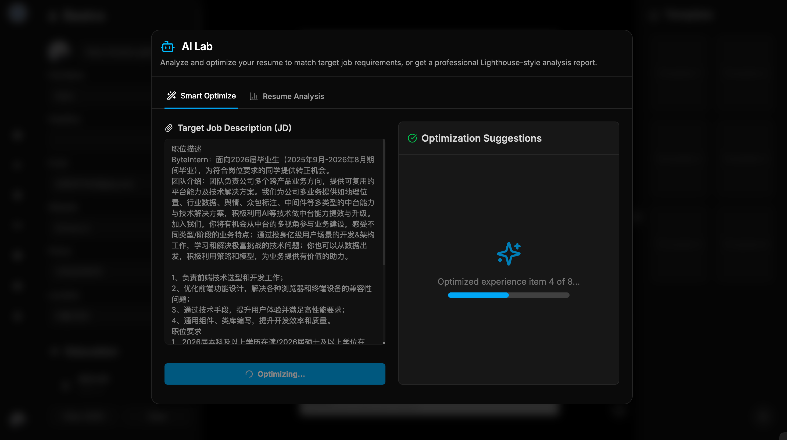
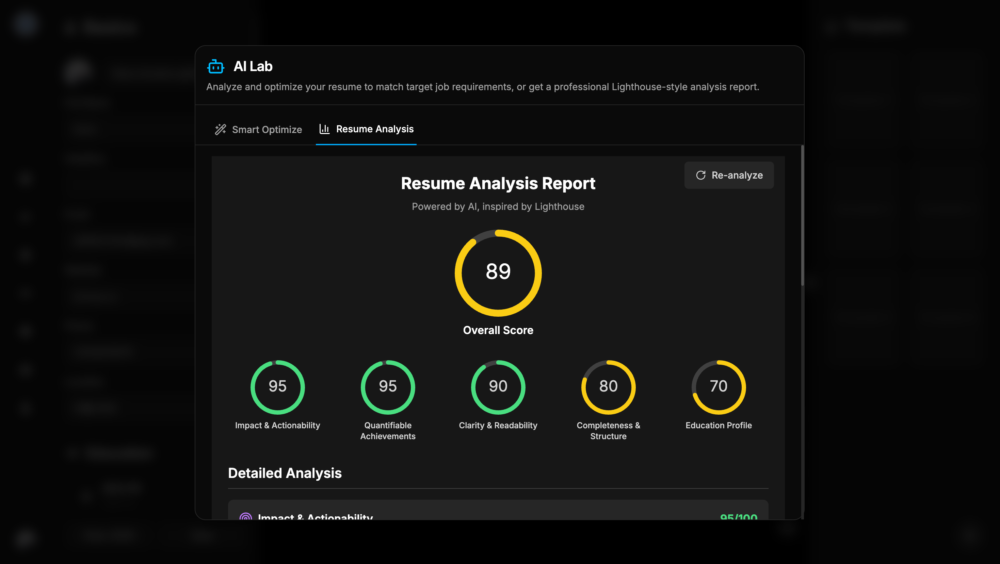
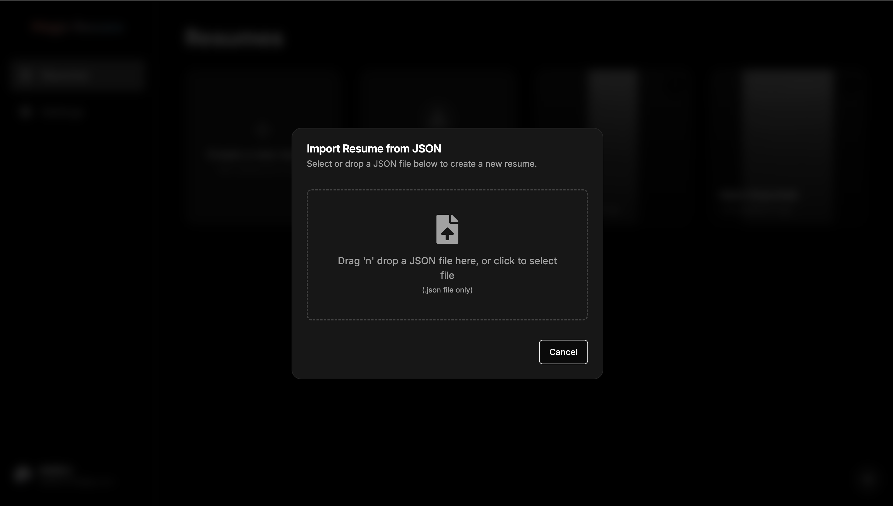
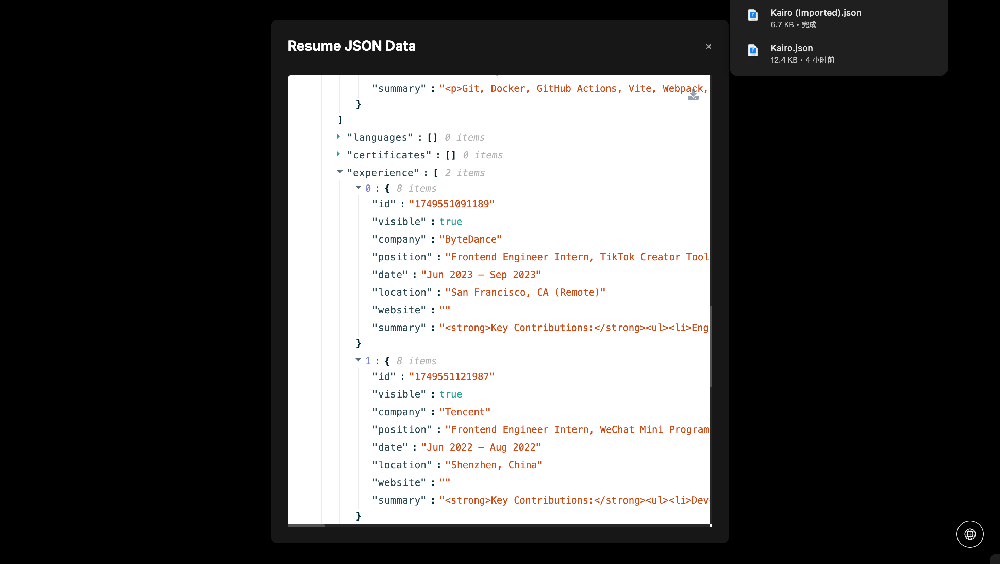

# Magic Resume

[](https://github.com/LinMoQC/Magic-Resume/blob/master/LICENSE) [](https://github.com/LinMoQC/Magic-Resume/stargazers) [](https://github.com/LinMoQC/Magic-Resume/network/members) [](https://github.com/LinMoQC/Magic-Resume/issues)

<br/>

<p align="center"></p>

## :scroll: 简介

**Magic Resume** 是一个由 AI 驱动的智能简历优化器。它基于 Next.js 构建，旨在帮助用户根据目标岗位（JD）的要求，智能地分析、优化个人简历，并提供专业建议。

---

## :sparkles: 项目结构

```text
resume/
|-- src/
|   |-- app/         # Next.js App Router 页面和路由
|   |-- components/  # 可复用的 UI 组件
|   |-- lib/         # 辅助函数、类型定义和 AI 相关逻辑
|   |-- prompts/     # AI 提示词模板
|   |-- store/       # Zustand 状态管理
|-- public/          # 静态资源 (图片, Logo)
|-- .env.local.example # 环境变量示例文件
|-- package.json
|-- next.config.ts
|-- README.md
```

## :wrench: 技术栈

- **核心框架**: [Next.js](https://nextjs.org/), [React](https://react.dev/)
- **UI & 样式**: [Tailwind CSS](https://tailwindcss.com/), [Radix UI](https://www.radix-ui.com/), [shadcn/ui](https://ui.shadcn.com/), [Framer Motion](https://www.framer.com/motion/)
- **AI 集成**: [LangChain](https://www.langchain.com/), [Vercel AI SDK](https://sdk.vercel.ai/)
- **状态管理**: [Zustand](https://zustand-demo.pmnd.rs/), [Immer](https://immerjs.github.io/immer/)
- **用户认证**: [Clerk](https://clerk.com/)
- **组件库**: [Lucide React](https://lucide.dev/) (图标), [Sonner](https://sonner.emilkowal.ski/) (通知)
- **其他**: [Dnd Kit](https://dndkit.com/) (拖拽), [Tiptap](https://tiptap.dev/) (富文本编辑器), [Zod](https://zod.dev/) (数据校验)
- **开发工具**: [TypeScript](https://www.typescriptlang.org/), [ESLint](https://eslint.org/), [Husky](https://typicode.github.io/husky/)

## :rocket: 本地运行

1.  **克隆仓库**
    ```bash
    git clone https://github.com/your-username/your-repo-name.git
    cd your-repo-name
    ```

2.  **安装依赖**
    ```bash
    npm install
    ```

3.  **配置环境变量**
    
    在项目根目录创建一个 `.env.local` 文件，并根据 `.env.local.example` 的内容填入您的密钥。
    ```bash
    # Clerk
    NEXT_PUBLIC_CLERK_PUBLISHABLE_KEY=your_publishable_key
    CLERK_SECRET_KEY=your_secret_key

    # OpenAI / LLM Provider
    # 如果您使用 OpenAI，请填入以下密钥
    OPENAI_API_KEY="sk-..."
    OPENAI_API_BASE_URL="https://api.openai.com/v1" # 可选，可替换为代理地址
    ```

4.  **启动开发服务器**
    ```bash
    npm run dev
    ```
    打开 [http://localhost:3000](http://localhost:3000) 查看结果。

## :gear: 其他命令

**构建项目:**
```bash
npm run build
```

**启动生产环境服务器:**
```bash
npm run start
```

**代码规范检查:**
```bash
npm run lint
```

## :camera: 项目截图

<table>
  <tr>
    <td align="center"><strong>在线编辑</strong></td>
    <td align="center"><strong>AI 智能优化</strong></td>
  </tr>
  <tr>
    <td></td>
    <td></td>
  </tr>
  <tr>
    <td align="center"><strong>AI 智能分析</strong></td>
    <td align="center"><strong>多种导入方式</strong></td>
  </tr>
  <tr>
    <td></td>
    <td></td>
  </tr>
  <tr>
    <td align="center"><strong>简历导出</strong></td>
    <td></td>
  </tr>
  <tr>
    <td></td>
    <td></td>
  </tr>
</table>

## :handshake: 贡献

我们非常欢迎各种形式的贡献！如果您在使用过程中发现任何问题，或有任何好的建议，请随时 [提交 issue](https://github.com/LinMoQC/Magic-Resume/issues/new) 或提交 Pull Request。

### :busts_in_silhouette: 贡献者

感谢以下开发者对 Magic Resume 作出的贡献：

<a href="https://github.com/nonebot/nonebot2/graphs/contributors">
  
</a>

## Star History

<a href="https://star-history.com/#LinMoQC/Magic-Resume&Date">
  <picture>
    <source media="(prefers-color-scheme: dark)" srcset="https://api.star-history.com/svg?repos=LinMoQC/Magic-Resume&type=Date&theme=dark" />
    <source media="(prefers-color-scheme: light)" srcset="https://api.star-history.com/svg?repos=LinMoQC/Magic-Resume&type=Date" />
    
  </picture>
</a>

## :heart: 许可

该项目使用 MIT 许可证。
