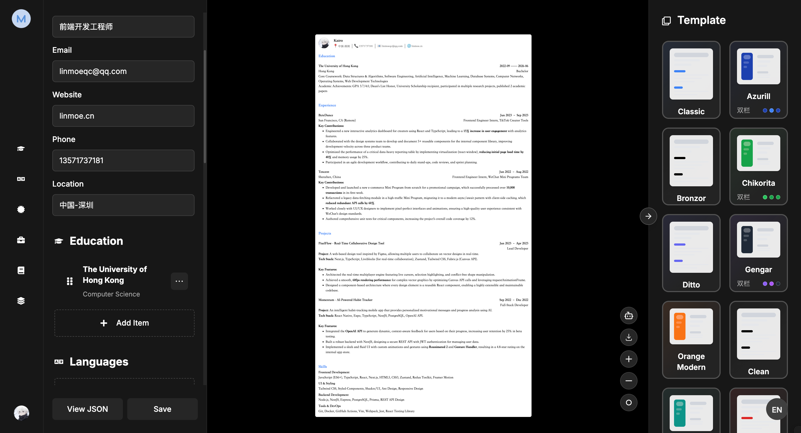

<div align="center">
  <a href="https://magic-resume.cn">
    
  </a>

  <h1>Magic Resume</h1>

  <p><strong>The AI-native resume platform — build, analyze, optimize, and edit resumes with AI coding tools.</strong></p>

**English** · [简体中文](./README.zh-CN.md) · [Official Site][official-site] · [Feedback][github-issues-link]

  <!-- SHIELD GROUP -->

[![][vercel-shield]][vercel-link]
[![][github-contributors-shield]][github-contributors-link]
[![][github-forks-shield]][github-forks-link]
[![][github-stars-shield]][github-stars-link]
[![][github-issues-shield]][github-issues-link]
[![][github-license-shield]][github-license-link]

</div>

<details>
<summary><kbd>Table of contents</kbd></summary>

#### TOC

- [👋🏻 Getting Started](#-getting-started)
- [✨ Features](#-features)
  - [Build: Visual Template Customization](#build-visual-template-customization)
  - [Analyze: Lighthouse-style Reports](#analyze-lighthouse-style-reports)
  - [Optimize: AI-powered JD Matching](#optimize-ai-powered-jd-matching)
  - [AI Lab: Interview & Translation](#ai-lab-interview--translation)
  - [Privacy: Local-First Data Security](#privacy-local-first-data-security)
- [🤖 MCP Integration](#-mcp-integration)
- [⚙️ Environment Variables](#️-environment-variables)
- [🛳 Self Hosting](#-self-hosting)
  - [Self-hosted Mode (No Backend Required)](#self-hosted-mode-no-backend-required)
  - [Deploying with Vercel](#deploying-with-vercel)
- [📦 Ecosystem](#-ecosystem)
- [⌨️ Local Development](#️-local-development)
- [🤝 Contributing](#-contributing)
- [📈 Star History](#-star-history)

####

<br/>

</details>

<br/>



## 👋🏻 Getting Started

**Magic Resume** is a modern, AI-native resume platform built as a Turborepo monorepo. It combines a real-time visual editor with multi-model AI capabilities — and goes further with a native **MCP server** that lets AI coding tools (Claude Code, Cursor, Windsurf) read and safely edit your resumes without guessing the data shape.

## ✨ Features

### Build: Visual Template Customization

Create a professional resume in minutes with our intuitive visual editor.

- **Real-time Preview**: See your changes instantly as you type.
- **12 Professional Templates**: ATS-friendly templates with full color, font, and layout control.
- **Rich Customization**: Adjust colors, fonts (22+ styles), spacing, and layouts with ease.
- **Version History**: Save snapshots and restore any previous version.
- **Resume Sharing**: Share via unique link with Viewer / Commenter / Editor permissions.

### Analyze: Lighthouse-style Reports

Get professional feedback on your resume's health.

- **Overall Score**: A comprehensive rating of your resume's impact.
- **Detailed Analysis**: Insights into keyword matching, actionability, and readability.
- **Actionable Suggestions**: Specific advice to make your resume stand out.

### Optimize: AI-powered JD Matching

Tailor your resume to specific job descriptions with AI.

- **Smart Alignment**: AI analyzes the Job Description (JD) and suggests targeted content optimizations.
- **Multi-model Support**: Works with OpenAI, Google Gemini, Anthropic Claude, and any OpenAI-compatible API.

### AI Lab: Interview & Translation

Go beyond editing with AI-powered career tools.

- **Interview Practice**: Simulate real interviews with AI feedback on your answers.
- **Resume Translation**: Translate your resume into any language while preserving formatting.

### Privacy: Local-First Data Security

Your data stays with you.

- **Local Storage**: All resume data is stored locally in IndexedDB by default — no account required.
- **Optional Cloud Sync**: Securely sync across devices if you choose.
- **Multi-format Export**: Export to high-quality PDF or structured JSON.

---

## 🤖 MCP Integration

Magic Resume ships a native **Model Context Protocol (MCP) server** (`@magic-resume/mcp`) — a first-class integration for AI coding tools.

Configure it once with a personal access token and your AI assistant can safely read and patch resumes without touching the raw database:

```bash
npx -y @magic-resume/mcp config set --api-url "https://your-api.example.com/api" --pat "mr_pat_xxx"
claude mcp add magic-resume -- npx -y @magic-resume/mcp mcp
```

**Available MCP tools:**

| Tool | Description |
|---|---|
| `list_resumes` | List all resumes in your account |
| `get_resume` | Fetch a resume's full content |
| `get_resume_schema` | Get the JSON schema for validation |
| `get_resume_editing_guide` | AI-readable guide on how to edit resumes |
| `preview_resume_patch` | Preview a JSON Patch without applying it |
| `update_resume_content` | Apply a JSON Patch to update resume content |

The MCP server is schema-aware and patch-based — AI tools make surgical edits rather than full rewrites.

---

## 🛠 Tech Stack

| Layer | Technology |
|---|---|
| Monorepo | [Turborepo](https://turbo.build/), [pnpm](https://pnpm.io/) |
| Framework | [Next.js 15](https://nextjs.org/) (App Router) |
| Language | [TypeScript](https://www.typescriptlang.org/) |
| AI / LLM | [LangChain](https://www.langchain.com/), [LangGraph](https://www.langchain.com/langgraph), [Google GenAI](https://ai.google.dev/), [Anthropic](https://www.anthropic.com/) |
| Authentication | [Clerk](https://clerk.com/) (cloud mode only) |
| Styling | [Tailwind CSS 4](https://tailwindcss.com/) |
| UI Components | [Radix UI](https://www.radix-ui.com/), [Lucide Icons](https://lucide.dev/) |
| Animations | [Framer Motion](https://www.framer.com/motion/), [GSAP](https://gsap.com/) |
| State Management | [Zustand](https://zustand-demo.pmnd.rs/) |
| Local Storage | [IndexedDB](https://developer.mozilla.org/en-US/docs/Web/API/IndexedDB_API) |
| Rich Text | [Tiptap](https://tiptap.dev/), [Monaco Editor](https://microsoft.github.io/monaco-editor/) |
| MCP | [@modelcontextprotocol/sdk](https://modelcontextprotocol.io/) |
| Schema | [Zod](https://zod.dev/) |
| Internationalization | [i18next](https://www.i18next.com/) |

---

## ⚙️ Environment Variables

All variables live in `apps/web/.env.local` (copy from `apps/web/.env.example`). Vars prefixed with `NEXT_PUBLIC_` are exposed to the browser; the rest are server-only.

| Variable | Required in | Default | Purpose |
|---|---|---|---|
| `NEXT_PUBLIC_APP_MODE` | both | auto | `self-hosted` or `cloud`. If unset, auto-detected: `cloud` when `NEXT_PUBLIC_CLERK_PUBLISHABLE_KEY` is set, otherwise `self-hosted`. |
| `NEXT_PUBLIC_APP_URL` | both | `https://magic-resume.cn` | Canonical base URL used by `metadataBase` for OG tags and SEO. Set to your deployed origin (e.g. `http://localhost:3000` in dev). |
| `NEXT_PUBLIC_CLERK_PUBLISHABLE_KEY` | cloud | — | Clerk publishable key (`pk_...`). Read by `@clerk/nextjs` on the client. |
| `CLERK_SECRET_KEY` | cloud | — | Clerk secret key (`sk_...`). Read by `@clerk/nextjs` on the server. |
| `NEXT_PUBLIC_CLOUD_API_URL` | cloud | `http://localhost:3111` | NestJS Core API base URL — used by `httpClient.api` for resumes, settings, sharing, PATs. |
| `BACKEND_URL` | AI features | `http://localhost:8000` | Python agent server — used by `httpClient.agent` and the `/api/interview/*` Next.js rewrite proxy (interview, translate, AI optimize/analyze). |

**Mode rules**

- **`self-hosted`** — pure browser. No Clerk, no Core API; data lives in IndexedDB. Only `NEXT_PUBLIC_APP_URL` is meaningful.
- **`cloud`** — requires the two Clerk keys plus `NEXT_PUBLIC_CLOUD_API_URL`. AI features additionally require `BACKEND_URL` (or remove AI features in your fork).

**Notes**

- Don't commit `.env.local` — it's gitignored. Use `.env.example` as the template.
- Public-prefixed values are inlined into the JS bundle at build time; never put secrets behind `NEXT_PUBLIC_`.
- Analytics env vars (PostHog / GA) were removed — product events go through the in-house tracking SDK in `apps/web/src/lib/analytics/core-events.ts`.

---

## 🛳 Self Hosting

### Self-hosted Mode (No Backend Required)

Magic Resume runs fully in the browser with no backend, no database, and no account required. Set `NEXT_PUBLIC_APP_MODE=self-hosted` (or leave it unset) and all data is persisted in IndexedDB.

```bash
git clone https://github.com/LinMoQC/Magic-Resume.git
cd Magic-Resume
cp apps/web/.env.example apps/web/.env.local
# Edit .env.local: set NEXT_PUBLIC_APP_MODE=self-hosted
pnpm install
pnpm run dev
```

### Deploying with Vercel

For the full cloud experience (auth, cloud sync, sharing), click the button below:

[](https://vercel.com/new/clone?repository-url=https%3A%2F%2Fgithub.com%2FLinMoQC%2FMagic-Resume)

> [!TIP]
> For cloud mode, configure `NEXT_PUBLIC_APP_MODE=cloud`, `NEXT_PUBLIC_CLERK_PUBLISHABLE_KEY`, and `CLERK_SECRET_KEY` in the Vercel dashboard.

---

## 📦 Ecosystem

This repository is a Turborepo monorepo. Key packages:

| Package | Description |
|---|---|
| `apps/web` | Next.js frontend — editor, dashboard, AI Lab |
| `packages/mcp` | `@magic-resume/mcp` — stdio MCP server and CLI |
| `packages/resume-schema` | Shared Zod schemas, types, and sample data |
| `packages/resume-templates` | Template DSL, renderer, and registry |

---

## ⌨️ Local Development

```bash
# Install dependencies
pnpm install

# Start all workspaces
pnpm run dev

# Or target a single workspace
pnpm --filter @magic-resume/web dev
pnpm --filter @magic-resume/mcp build

# Lint and test
pnpm run lint
pnpm run test
```

---

## 🤝 Contributing

Contributions are welcome! Please feel free to submit a Pull Request.

For bug reports and feature requests, open an [issue][github-issues-link].

<a href="https://github.com/LinMoQC/Magic-Resume/graphs/contributors">
  
</a>

---

## 📈 Star History

[](https://star-history.com/#LinMoQC/Magic-Resume&Date)

---

Copyright © 2026 [Magic Resume Team](https://github.com/LinMoQC). <br />
This project is [MIT](./LICENSE) licensed.

<!-- LINK GROUP -->

[official-site]: https://magic-resume.cn
[github-issues-link]: https://github.com/LinMoQC/Magic-Resume/issues
[vercel-shield]: https://img.shields.io/badge/vercel-online-55b467?labelColor=black&logo=vercel&style=flat-square
[vercel-link]: https://magic-resume.cn
[github-contributors-shield]: https://img.shields.io/github/contributors/LinMoQC/Magic-Resume?color=c4f042&labelColor=black&style=flat-square
[github-contributors-link]: https://github.com/LinMoQC/Magic-Resume/graphs/contributors
[github-forks-shield]: https://img.shields.io/github/forks/LinMoQC/Magic-Resume?color=8ae8ff&labelColor=black&style=flat-square
[github-forks-link]: https://github.com/LinMoQC/Magic-Resume/network/members
[github-stars-shield]: https://img.shields.io/github/stars/LinMoQC/Magic-Resume?color=ffcb47&labelColor=black&style=flat-square
[github-stars-link]: https://github.com/LinMoQC/Magic-Resume/stargazers
[github-issues-shield]: https://img.shields.io/github/issues/LinMoQC/Magic-Resume?color=ff80eb&labelColor=black&style=flat-square
[github-license-shield]: https://img.shields.io/badge/license-MIT-white?labelColor=black&style=flat-square
[github-license-link]: https://github.com/LinMoQC/Magic-Resume/blob/master/LICENSE
