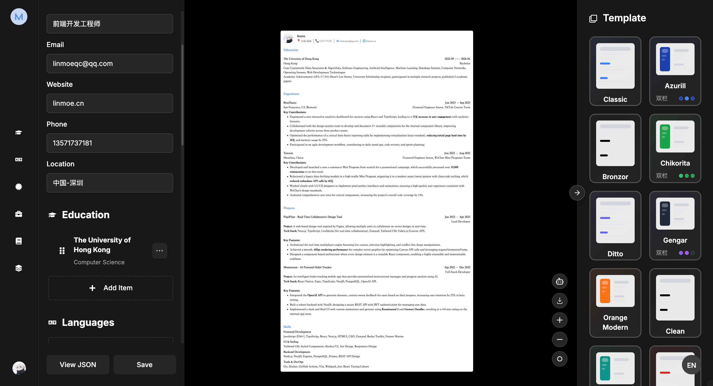
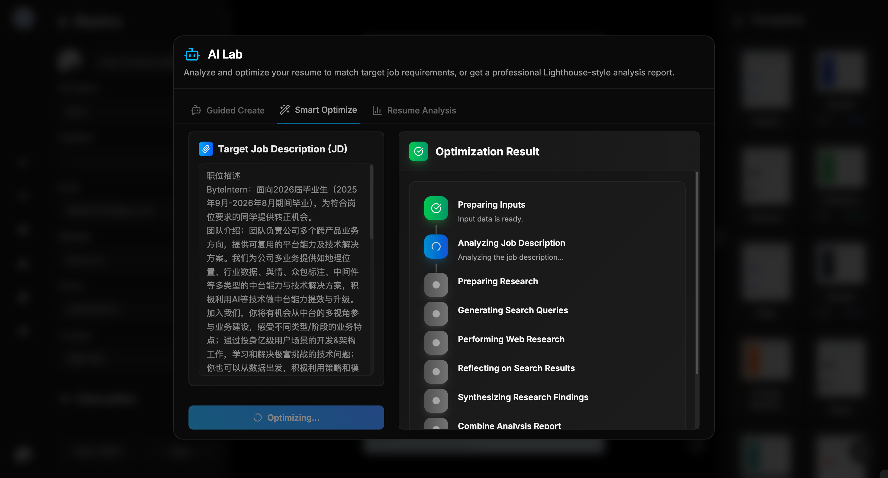

<div align="center">
  
  
  <p><strong>AI 驱动的现代化简历构建器</strong></p>
  
  [](https://github.com/LinMoQC/Magic-Resume/blob/master/LICENSE) [](https://github.com/LinMoQC/Magic-Resume/stargazers) [](https://github.com/LinMoQC/Magic-Resume/network/members) [](https://github.com/LinMoQC/Magic-Resume/issues)
</div>

---

## 🌟 项目简介

**Magic Resume** 是一款现代化的 AI 驱动简历构建器，采用 Next.js 14 构建。它不仅提供直观的在线编辑体验，还能根据目标职位智能优化简历内容，让您的求职之路更加顺畅。

### ✨ 核心特性

- 🎨 **可视化模板自定义** - 22种精美字体 + 实时颜色/布局调整
- 🤖 **AI 智能优化** - 根据 JD 自动优化简历内容和匹配度
- 📊 **专业分析报告** - Lighthouse 风格的简历健康度分析
- 🌐 **完整国际化** - 中英文界面无缝切换
- 💾 **本地存储优先** - 数据安全，支持多格式导出
- 🎯 **实时预览** - 所见即所得的编辑体验

---

## 🏗️ 技术架构

<div align="center">

| 分类 | 技术栈 |
|------|-------|
| **前端框架** | Next.js 14 · React 18 · TypeScript |
| **UI 设计** | Tailwind CSS · Radix UI · shadcn/ui · Framer Motion |
| **AI 能力** | OpenAI API · Tavily Search · LangChain |
| **用户认证** | Clerk · NextAuth (可选) |
| **第三方集成** | GitHub API · 后端服务支持 |
| **状态管理** | Zustand · Immer |
| **富文本** | Tiptap Editor · Dnd Kit |
| **工具链** | ESLint · Husky · Zod |

</div>

## 📁 项目结构

```
resume/
├── src/
│   ├── app/                    # Next.js App Router
│   │   ├── dashboard/          # 仪表盘页面
│   │   ├── components/         # 全局组件
│   │   └── globals.css         # 全局样式
│   ├── templates/              # 简历模板系统
│   │   ├── config/             # 模板配置
│   │   ├── templateLayout/     # 布局组件
│   │   ├── TemplateCustomizer/ # 自定义器组件
│   │   └── renderer/           # 渲染引擎
│   ├── lib/                    # 工具库
│   ├── store/                  # 状态管理
│   ├── locales/                # 国际化
│   └── prompts/                # AI 提示词
└── public/                     # 静态资源
```

## 🚀 快速开始

### 📦 安装与配置

```bash
# 1. 克隆项目
git clone https://github.com/LinMoQC/Magic-Resume.git
cd Magic-Resume

# 2. 安装依赖
npm install

# 3. 配置环境变量
cp .env.local.example .env.local
# 编辑 .env.local 填入您的密钥
```

### 🔑 环境变量配置

项目根目录已包含 `.env.local.example` 示范文件，包含详细的配置说明：

```bash
# 复制示范文件
cp .env.local.example .env.local

# 编辑配置文件，填入您的密钥
vim .env.local  # 或使用您喜欢的编辑器
```

**核心配置项：**

| 配置类别 | 必需性 | 说明 |
|---------|-------|------|
| **Clerk 认证** | ✅ 必需 | 用户登录注册系统 |
| **后端服务** | ⚙️ 可选 | 完整后端支持 |

### 🏃‍♂️ 运行项目

```bash
# 开发环境
npm run dev

# 生产构建
npm run build && npm run start

# 代码检查
npm run lint
```

打开 [http://localhost:3000](http://localhost:3000) 开始使用！

### 🔧 详细配置指南

<details>
<summary><strong>📋 Clerk 用户认证配置 (必需)</strong></summary>

1. 访问 [Clerk.com](https://clerk.com/) 注册账号
2. 创建新应用，选择认证方式
3. 在 Dashboard → API Keys 获取密钥：
   ```env
   NEXT_PUBLIC_CLERK_PUBLISHABLE_KEY=pk_test_xxx
   CLERK_SECRET_KEY=sk_test_xxx
   ```
4. 配置重定向URL（可选）

</details>

<details>
<summary><strong>🤖 AI 功能配置 (可选)</strong></summary>

**OpenAI API** - 简历智能优化
1. 访问 [OpenAI Platform](https://platform.openai.com/) 
2. 创建 API 密钥
3. 配置：`OPENAI_API_KEY=sk-xxx`

**Tavily API** - 智能搜索增强
1. 访问 [Tavily.com](https://tavily.com/)
2. 注册并获取 API 密钥
3. 配置：`TAVILY_API_KEY=tvly-xxx`

</details>

<details>
<summary><strong>📱 GitHub 集成 (可选)</strong></summary>

用于从 GitHub 导入项目数据：
1. 访问 [GitHub Settings → Tokens](https://github.com/settings/tokens)
2. 生成 Personal Access Token
3. 配置：`GITHUB_TOKEN=ghp-xxx`
4. 权限选择：`repo`, `user:email`

</details>

<details>
<summary><strong>🚀 后端服务配置 (可选)</strong></summary>

如需使用完整后端功能：
1. 启动后端服务（通常在端口 8000）
2. 配置后端地址：`BACKEND_URL=http://127.0.0.1:8000`
3. 启用后端：`NEXT_PUBLIC_IF_USE_BACKEND=true`
4. 详见后端项目的部署文档

</details>

<details>
<summary><strong>🔐 认证系统配置</strong></summary>

**Clerk (推荐)** - 现代认证方案
- 完整的用户管理界面
- 多种登录方式支持

**NextAuth (可选)** - 传统认证方案  
- 配置：`NEXTAUTH_URL` 和 `NEXTAUTH_SECRET`
- 适用于自定义认证需求

</details>

## 💡 功能特性详解

### 🎨 模板自定义系统

<table>
<tr>
<td width="50%">

**颜色主题**
- 5种快速主题切换
- 6种详细颜色配置
- 实时预览效果

**字体系统**  
- 22种精选字体
- 包含现代、手写、科技感字体
- 6级字体大小调节

</td>
<td width="50%">

**布局控制**
- 容器宽度调整 (600-1000px)
- 内边距和间距设置
- 文本行高和字符间距
- 段落和章节间距

**实时保存**
- 自动保存配置差异
- 减少90%存储空间
- 完整的撤销/重做

</td>
</tr>
</table>

### 🤖 AI 智能功能

| 功能 | 技术支持 | 描述 |
|-----|---------|------|
| **智能优化** | OpenAI GPT | 根据 JD 自动优化简历内容 |
| **健康分析** | AI 分析引擎 | Lighthouse 风格的专业分析 |
| **引导创建** | 对话式 AI | AI 对话式简历生成 |
| **智能搜索** | Tavily API | 增强的网络搜索能力 |
| **GitHub 集成** | GitHub API | 自动导入项目经历 |

## 📸 产品预览

<div align="center">
<table>
  <tr>
    <td align="center" width="50%"><strong>🎨 模板自定义</strong></td>
    <td align="center" width="50%"><strong>🤖 AI 智能优化</strong></td>
  </tr>
  <tr>
    <td></td>
    <td></td>
  </tr>
  <tr>
    <td align="center"><strong>💬 AI 对话助手</strong></td>
    <td align="center"><strong>🎯 文本选择优化</strong></td>
  </tr>
  <tr>
    <td></td>
    <td></td>
  </tr>
  <tr>
    <td align="center"><strong>📊 专业分析</strong></td>
    <td align="center"><strong>📱 多端适配</strong></td>
  </tr>
  <tr>
    <td></td>
    <td></td>
  </tr>
</table>
</div>

---

## 🤝 参与贡献

我们欢迎所有形式的贡献！无论是新功能、Bug 修复、文档改进还是问题反馈。

### 📋 贡献指南

1. **Fork 项目** 并创建您的功能分支
2. **提交变更** 并编写清晰的 commit 信息  
3. **推送到分支** 并创建 Pull Request
4. **等待审核** 我们会尽快回复

```bash
git checkout -b feature/amazing-feature
git commit -m 'feat: 添加某个很棒的功能'
git push origin feature/amazing-feature
```

### 💻 贡献者

感谢所有为 Magic Resume 做出贡献的开发者！

<a href="https://github.com/LinMoQC/Magic-Resume/graphs/contributors">
  
</a>

---

## 📈 Star History

<div align="center">
  <a href="https://star-history.com/#LinMoQC/Magic-Resume&Date">
    <picture>
      <source media="(prefers-color-scheme: dark)" srcset="https://api.star-history.com/svg?repos=LinMoQC/Magic-Resume&type=Date&theme=dark" />
      <source media="(prefers-color-scheme: light)" srcset="https://api.star-history.com/svg?repos=LinMoQC/Magic-Resume&type=Date" />
      
    </picture>
  </a>
</div>

---

## 📄 开源协议

本项目基于 [MIT License](LICENSE) 开源协议。

<div align="center">
  <p>如果这个项目对您有帮助，请考虑给我们一个 ⭐</p>
  <p>Made with ❤️ by Magic Resume Team</p>
</div>
