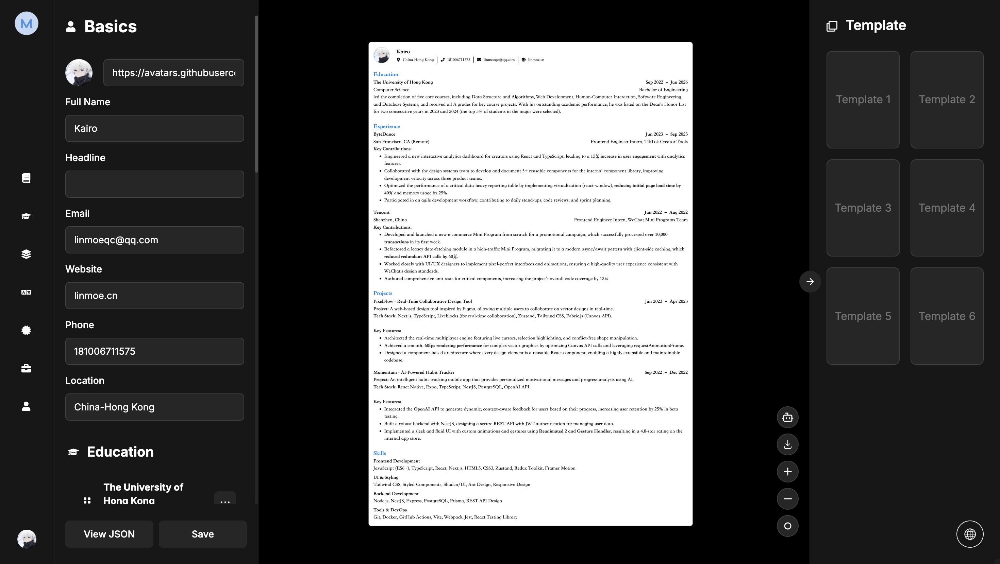

<div align="center">
  <a href="https://magic-resume.cn">
    
  </a>

  <h1>Magic Resume</h1>

  <p><strong>下一代 AI 简历平台，让招聘变得简单。</strong></p>

[English](./README.md) · **简体中文** · [官方网站][official-site] · [问题反馈][github-issues-link]

  <!-- SHIELD GROUP -->

[![][vercel-shield]][vercel-link]
[![][github-contributors-shield]][github-contributors-link]
[![][github-forks-shield]][github-forks-link]
[![][github-stars-shield]][github-stars-link]
[![][github-issues-shield]][github-issues-link]
[![][github-license-shield]][github-license-link]

</div>

<details>
<summary><kbd>目录</kbd></summary>

#### TOC

- [👋🏻 快速开始](#-快速开始)
- [✨ 功能特性](#-功能特性)
  - [制作：可视化模板自定义](#制作可视化模板自定义)
  - [分析：Lighthouse 风格报告](#分析lighthouse-风格报告)
  - [优化：智能 JD 匹配](#优化智能-jd-匹配)
  - [隐私：本地优先的数据安全](#隐私本地优先的数据安全)
- [🛳 私有化部署](#-私有化部署)
  - [使用 Vercel 部署](#使用-vercel-部署)
- [📦 生态系统](#-生态系统)
- [⌨️ 本地开发](#️-本地开发)
- [🤝 参与贡献](#-参与贡献)
- [📈 Star 历史](#-star-历史)

####

<br/>

</details>

<br/>



## 👋🏻 快速开始

**Magic Resume** 是一款现代化的 AI 驱动简历生成器，旨在帮助求职者轻松制作专业且极具影响力的简历。基于 Next.js 15 构建，它将优雅的用户界面与强大的 AI 能力相结合，助力您的求职之旅。

## ✨ 功能特性

### 制作：可视化模板自定义

使用我们直观的可视化编辑器，在几分钟内创建专业简历。

- **实时预览**：输入时即可立即看到更改。
- **灵活模板**：从专业且对 ATS 友好的模板中进行选择。
- **丰富定制**：轻松调整颜色、字体（22+ 种样式）、间距和布局。

### 分析：Lighthouse 风格报告

获取关于简历健康状况的专业反馈。

- **总体评分**：对简历影响力的全面评价。
- **详细分析**：深入了解关键词匹配、可行动性和可读性。
- **可操作建议**：提供具体建议，让您的简历脱颖而出。

### 优化：智能 JD 匹配

使用 AI 为特定职位描述量身定制简历。

- **智能对齐**：AI 分析职位描述 (JD) 并建议内容优化。
- **基于角色的建议**：针对特定行业和角色提供定制化建议。

### 隐私：本地优先的数据安全

您的数据由您掌握。

- **本地存储**：默认情况下，所有简历数据都存储在浏览器的本地。
- **可选云端同步**：如果您选择，可以安全地跨设备同步数据。
- **多格式导出**：将简历导出为高质量 PDF 或结构化 JSON。

---

## 🛠 技术栈

- **框架**: [Next.js 15](https://nextjs.org/) (App Router)
- **语言**: [TypeScript](https://www.typescriptlang.org/)
- **AI / 大模型**: [LangChain](https://www.langchain.com/), [LangGraph](https://www.langchain.com/langgraph), [Google GenAI](https://ai.google.dev/), [Anthropic](https://www.anthropic.com/)
- **身份认证**: [Clerk](https://clerk.com/)
- **样式方案**: [Tailwind CSS 4](https://tailwindcss.com/)
- **组件库**: [Radix UI](https://www.radix-ui.com/), [Lucide Icons](https://lucide.dev/)
- **动画**: [Framer Motion](https://www.framer.com/motion/), [GSAP](https://gsap.com/)
- **状态管理**: [Zustand](https://zustand-demo.pmnd.rs/)
- **数据库/存储**: [IndexedDB](https://developer.mozilla.org/en-US/docs/Web/API/IndexedDB_API) (本地优先)
- **富文本编辑器**: [Tiptap](https://tiptap.dev/), [Monaco Editor](https://microsoft.github.io/monaco-editor/)
- **国际化**: [i18next](https://www.i18next.com/)
- **分析工具**: [PostHog](https://posthog.com/)

---

## 🛳 私有化部署

在几分钟内部署您自己的 Magic Resume 实例。

### 使用 Vercel 部署

点击下方按钮部署到 Vercel：

[](https://vercel.com/new/clone?repository-url=https%3A%2F%2Fgithub.com%2FLinMoQC%2FMagic-Resume)

> [!TIP]
>
> 请记得在 Vercel 控制面板中配置您的 `NEXT_PUBLIC_CLERK_PUBLISHABLE_KEY` 和 `CLERK_SECRET_KEY`。

---

## 📦 生态系统

- **Magic Resume Core**：主简历生成器和 AI 引擎。
- **i18n Scanner**：自定义工具，确保完整的本地化覆盖。

---

## ⌨️ 本地开发

克隆仓库并启动开发服务器：

```bash
$ git clone https://github.com/LinMoQC/Magic-Resume.git
$ cd Magic-Resume
$ npm install
$ npm run dev
```

更多详情，请查看我们的 [开发指南](./docs/development.md)（即将上线）。

---

## 🤝 参与贡献

欢迎贡献！请随时提交 Pull Request。

<a href="https://github.com/LinMoQC/Magic-Resume/graphs/contributors">
  
</a>

---

## 📈 Star 历史

[](https://star-history.com/#LinMoQC/Magic-Resume&Date)

---

Copyright © 2026 [Magic Resume Team](https://github.com/LinMoQC). <br />
本项目采用 [MIT](./LICENSE) 开源协议。

<!-- LINK GROUP -->

[official-site]: https://magic-resume.cn
[github-issues-link]: https://github.com/LinMoQC/Magic-Resume/issues
[vercel-shield]: https://img.shields.io/badge/vercel-online-55b467?labelColor=black&logo=vercel&style=flat-square
[vercel-link]: https://magic-resume.cn
[github-contributors-shield]: https://img.shields.io/github/contributors/LinMoQC/Magic-Resume?color=c4f042&labelColor=black&style=flat-square
[github-contributors-link]: https://github.com/LinMoQC/Magic-Resume/graphs/contributors
[github-forks-shield]: https://img.shields.io/github/forks/LinMoQC/Magic-Resume?color=8ae8ff&labelColor=black&style=flat-square
[github-forks-link]: https://github.com/LinMoQC/Magic-Resume/network/members
[github-stars-shield]: https://img.shields.io/github/stars/LinMoQC/Magic-Resume?color=ffcb47&labelColor=black&style=flat-square
[github-stars-link]: https://github.com/LinMoQC/Magic-Resume/stargazers
[github-issues-shield]: https://img.shields.io/github/issues/LinMoQC/Magic-Resume?color=ff80eb&labelColor=black&style=flat-square
[github-license-shield]: https://img.shields.io/badge/license-MIT-white?labelColor=black&style=flat-square
[github-license-link]: https://github.com/LinMoQC/Magic-Resume/blob/master/LICENSE
[github-release-link]: https://github.com/LinMoQC/Magic-Resume/releases
[github-release-shield]: https://img.shields.io/github/v/release/LinMoQC/Magic-Resume?color=369eff&labelColor=black&logo=github&style=flat-square
[image-star]: https://github.com/user-attachments/assets/3216e25b-186f-4a54-9cb4-2f124aec0471
